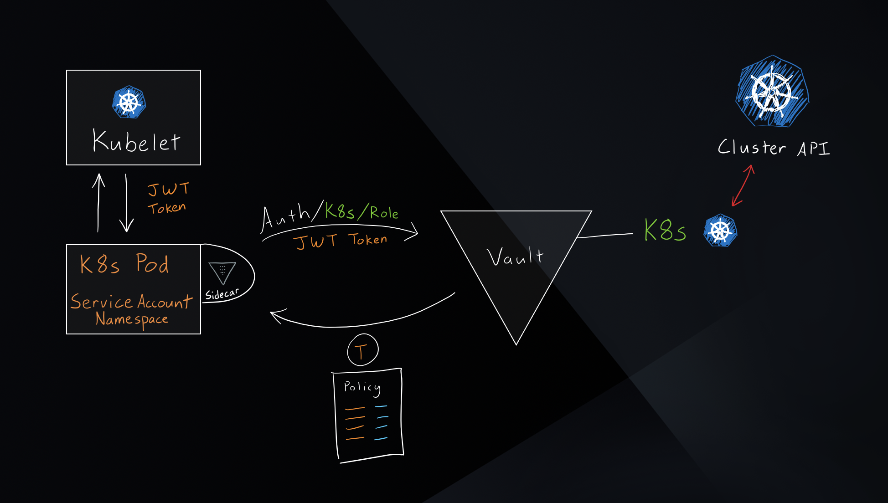

# Demystifying Secret Management in Kubernetes
## Contents

- Purpose, Assumptions and Target Audience
- Intro to Secrets & Secret Management 
- 4 Modern Patters for Managing Secrets in Kubernetes
- A Tale of Two Vault & Kubernetes Integrations
- Common Design Considerations
- Similarities & Differences between Sidecar & CSI Solutions
- Going Beyond the Native Kubernetes Secrets 
- Summary
- Additional Resources

## Scope, Assumptions and Target Audience

In this post, I will explore the different methods integrating HashiCorp Vault with Kubernetes and provide you with practical guidance to help you understand and choose the best solution for your use-case. This post is not intended to be a product documentation or step-by-step implementation guide. It is indended for DevOps practionars with familiarity with Vault and Kubernetes and have basic understanding of secret management concepts.

## What are Secrets and Why You Should Care

Secrets are anything that you want to tightly control access to such as: key/value pairs containing senstive data, tokens, passwords, TLS keys and certs, API/Cloud keys, and database credentials. Unlike application configurations, secrets can be sensitive, dynamic, time-scoped and require access control and a detailed audit log. They can also have a different life-cycle than the applications that consume them. For these reasons, secret management solutions, like Vault, have emerged to address the complexity of storing different types of secrets securely and provide a centralized, API-driven workflow to manage them across different environments.   

## 4 Modern Patters for Managing Secrets in Kubernetes

Traditionally, applications are composed of the business logic sourecode, some dependencies, backing services, configurations and secrets. Legacy applications packaged all of these components as part of the release and deployment procecesses effectively creating a monolith. Although this approach ensured all dependencies of the applications are included in the deployment unit, it soon introduced security, operational, and scale challenges. In contrast, modern application patterns (including microservices and 12-factor apps) shifted the structure of the applications to smaller autonmous microservices with externalized & decoupled backing services, configurations, and secrets. Although these newer patterns enhanced the overall application delivery process, they have also introduced architectural complexity and operational challenges especially with the rise of cloud. Kubernetes (k8s) took aim at solving these challenges and emerged as the de-facto platform to run applications at scale. 

Organizations are now rapidly adopting Kubernetes and leveraging this momentum to adopt modern and secure patterns for managing secrets in Kubernetes. The first pattern we are seeing these organizations adopt is decoupling secrets from the application lifecycle by leveraging automation and CI tooling to create separate workflows for creating and managing secrets. Second, they are ensuring secrets never make their way into version control systems typically by using scanning tools. Third, they are leveraging native k8s constructs to define and manage application secrets similar to how they define and manage application deployments. This is typically done by leveraging the native k8s secrets objects. Kubernetes has native support for secrets and utilizes etcd to store them and manage their access policies similar to other k8s objects. Compared with traditional patterns of embedding secrets alongside other application deployment and configurations assets, leveraging k8s secrets is a significant security advancement because k8s now encrypts these secrets at rest in etcd (if enabled) and automatically presents them to the applications that have access to them. The fourth pattern is integrating a secrets management solution, namely Vault, with Kubernetes combining the power of using a full-fledged, feature-rich, and centralized secrets management solution with the ease of application deplomyment orchestration in Kubernetes. This approach goes beyond what the native K8s secrets offer and addresses a larger set of advanced applications and use-cases. Let's dive into this specific pattern to understand its advantages and compare available methods to adopt it!

## A Tale of Two Vault & Kubernetes Integrations

There are a few open-source projects out there that integrate Vault with Kubernetes. I will focus on two open-source solutions which are developed, maintained, and supported by HashiCorp:

1. [Vault Sidecar Agent Injector](https://www.vaultproject.io/docs/platform/k8s/injector) leverages the [sidecar pattern](https://docs.microsoft.com/en-us/azure/architecture/patterns/sidecar) to alter pod specifications to include a Vault agent container that renders Vault secrets to a shared memory volume. By rendering secrets to a shared volume, containers within the pod can consume Vault secrets without being Vault aware. The injector is a Kubernetes Mutation Webhook Controller. The controller intercepts pod events and applies mutations to the pod if annotations exist within the request. This functionality is provided by the vault-k8s project and can be automatically installed and configured using the Vault Helm chart.

2. [Vault CSI Driver](https://www.vaultproject.io/docs/platform/k8s/csi) allows pods to render Vault secrets by employing ephemeral volumes using the [CSI Secrets Store](https://github.com/kubernetes-sigs/secrets-store-csi-driver). 

At a high level, the CSI Secrets Store driver allows users to create SecretProviderClass objects. This object defines which secret provider to use and what secrets to retrieve. When pods requesting CSI volumes are created, the CSI Secrets Store driver will send the request to the Vault CSI Provider if the provider is vault. The Vault CSI Provider will then use Secret Provider Class specified and the pod's service account to retrieve the secrets from Vault, and mount them into the pod's CSI volume.

The secret is retrieved from Vault and populated to the CSI secrets store volume during the ContainerCreation phase. This means that pods will be blocked from starting until the secrets have been read from Vault and written to the volume.

There are some similarities and differences between the two solutions that you would need to consider when designing and implementing your secret management strategy. Before I walk you through them, let's go through common design considerations to keep in mind.

## Common Design Considerations
 
1. Secret Projections: Every application requires secrets to be presented to it in a specific way. Typically, applications expect secrets to be either exported as environment variables or written to a file that the application can read on startup. Keep that in mind as you’re deciding on the right method to use to ensure that it meets your application requirements.

2. Secret Scope: Some applications are deployed across multiple k8s environments (e.g dev, qa, prod) across your datacenter, edge or public clouds. Some services run outside of k8s on VMs, serverless, or other cloud-managed services. You may face scenarios where these applications need to share some sets of secrets across these heterogenious environments without the need to replicate the secrets. Scoping the secrets correctly to be either local to the k8s enviornment or global across different environment will ensure that each application can easily and securely access its own set of secrets within the environment it is deployed in. 

3. Secret Types. Secrets can be text files, binary files, tokens, certs. They can be statically or dynamically generated. They can be valid permanently or time-scoped. They also vary is size. You need to consider which secret types your application requires and how they’re projected into the application.

4. Secret Definition: You would also need to consider how each secret is defined, created, updated, removed and the tooling associated with that process.

5. Encryption: Encrypting secrets both at rest and in-transit is a critical requirement for many enterprise organizations.   

6. Governance: Applications and secrets can have a many-to-many relationship which would require careful considerations when it comes to granting access for applications to retrieve their respective secrets. As the number of applications and secrets scales so does the challenge of managing their access policies. 

7. Secrets Updates & Rotation:  Secrets can be leased, time-scoped, or automatically rotated and in each of these scenarios there needs to be a programmatic process to ensure the new secret is properly propagated to the application pods. 

8. Secret Caching:  In certain K8s environments (e.g edge or retail) there is a potential need for secret caching in the case of communication or network failures between the environment and the secret storage. 

9. Auditability:  Keeping a secret access audit log detailing all secret access information is critical to ensure traceability of secret access events. 
 
Keeping these design considerations in mind, let's go over some of the similarities and differences between the two integration solutions.

## Similarities & Differences between the Sidecar and CSI Solutions

Let's start with some of the **similarities** between the two solutions:

1. Both solutions simplify retrieving different types of secrets stored in Vault and expose them to the target pod running on K8s without it being aware of the not-so-trival process. It's important to note that there is no need to make any changes in the application logic or code in order for it to use these solutions making it easier to migrate brownfield applications into Kubernetes. Developers working on greenfield applications are leveraging the [Vault SDKs](https://www.vaultproject.io/api/libraries) to directly integrate with Vault. 

2. Both support all types of Vault [Secret Engines](https://www.vaultproject.io/docs/secrets). This means that you can leverage the extensive set of secret types ranging from static KV secrets to dynamically generated database credentials and TLS certs with cusomized TTL.

3. Both leverage the application the k8s service account as Secret Zero to authenticate with Vault. This means that there is no need to manage yet another separate identity to identify the application pods when authenticating to Vault. Kubernetes auth method is required for both.

4. Both require the desired secrets exist within Vault.

5. Both expect the pods service account to be bound to a Vault role with a policy enabling access to desired secrets (e.g k8s RBAC isn't used to authorize access to secrets)

6. Both can be deployed via a Helm Chart.

7. Both require successfully retriveing secrets from Vault before the pods are started. 

8. Both rely on user-defined pod annotations to retrieve the required secrets from Vault. 

Let's go over how the two solution are different:

1. The Sidecar Agent Injector solution is composed of two elements. **Sidecar Service Injector** is deployed as a cluster service and is responsible for intercepting K8s apiserver pod events and mutating pod specs to add required sidecar containers. **Vault Sidecar Container** is deployed alongside **each** application pod and is responsible for authenticating with and retriveing secrets from Vault. In contrast, the Vault CSI Driver is deployed as a daemonset on every node in the k8s cluster and uses Secret Provider Class specified and the pod's service account to retrieve the secrets from Vault, and mount them into the pod's CSI volume.

2. The Sidecar Agent Injector supports [all](https://www.vaultproject.io/docs/platform/k8s/injector/annotations#vault-hashicorp-com-auth-path) Vault authentication methods. The Sidecar CSI driver [only supports Vault's Kubernetes auth method](https://www.vaultproject.io/docs/platform/k8s/csi/configurations#vaultkubernetesmountpath). 

3. The sidecar container launched with every application pod uses [Vault Agent](https://www.vaultproject.io/docs/agent) which provides a powerful set of capabilities such as auto-auth,templating and caching. The CSI driver does not use the Vault Agent and therfore lacks these functionalities.

4. The Vault CSI Driver supports rendering Vault secrets into both K8s secrets and environment variables. Sidecar Injector Service does not support rendering secrets into k8s secrets however there are [ways using agent templating](https://www.vaultproject.io/docs/platform/k8s/injector/examples#environment-variable-example) to render secrets into environment variables. 

5. The CSI Driver uses `hostPath` to mount ephemeral volumes into the pods which some container platform (e.g OpenShift) disable by default. On the other hand, Sidecar Agent Service uses in-memory tmpfs volumes instead.

6. Sidecar Injector Service [automatically](https://www.vaultproject.io/docs/agent/template#renewals-and-updating-secrets) renews, rotates, and fetches secrets/tokens. The CSI Driver does not support that. 

TODO INSERT TABLE

## Going Beyond the Native Kubernetes Secrets 

Although from the surface k8s native secrets might seem quite similar to the two approaches presented above, there are major differences between them that I will highlight a few of them.

First, kubernetes is NOT a secrets management solution. It does have native support for secrets, but that is quite different from an enterprise secret management solution. Most applications will have some services running outside k8s or in different k8s clusters. Having these applications use k8s secrets from outside a k8s environment will be cumbersome and introduce authentication & authorization challenges.

Second, k8s secrets are static in nature. You can define secrets by using kubectl or the k8s API but once they are defined they are stored in etcd and only presented to pods during pod creation. This can create scenarios where secrets get stale, outdated, or expired requiring additional workflows to update and rotate the secrets and redploying the application to use the new version of the secrets. This can cause added complexity and wasted time. 

Third, the security model of secret access management is tied with the k8s RBAC model. This can be challenging to adopt for users that are either not familiar or do not have the experience working with kubernetes.

## Summary

Designing for secret management in kubernetes is no easy task. There are multiple approaches each with its own set of pros & cons. I highly recommend exploring the different options and their internals to figure out what is the best option for you.

## Resources

- [HashiCorp Vault: Delivering Secrets with Kubernetes](https://medium.com/hashicorp-engineering/hashicorp-vault-delivering-secrets-with-kubernetes-1b358c03b2a3)
- [Retrieve HashiCorp Vault Secrets with Kubernetes CSI](https://www.hashicorp.com/blog/retrieve-hashicorp-vault-secrets-with-kubernetes-csi)
- [Learn Guide: Mount Vault Secrets through Container Storage Interface (CSI) Volume](https://learn.hashicorp.com/tutorials/vault/kubernetes-secret-store-driver?in=vault/kubernetes)
- [Learn Guide: Injecting Secrets into Kubernetes Pods via Vault Agent Containers ](https://learn.hashicorp.com/tutorials/vault/kubernetes-sidecar)

